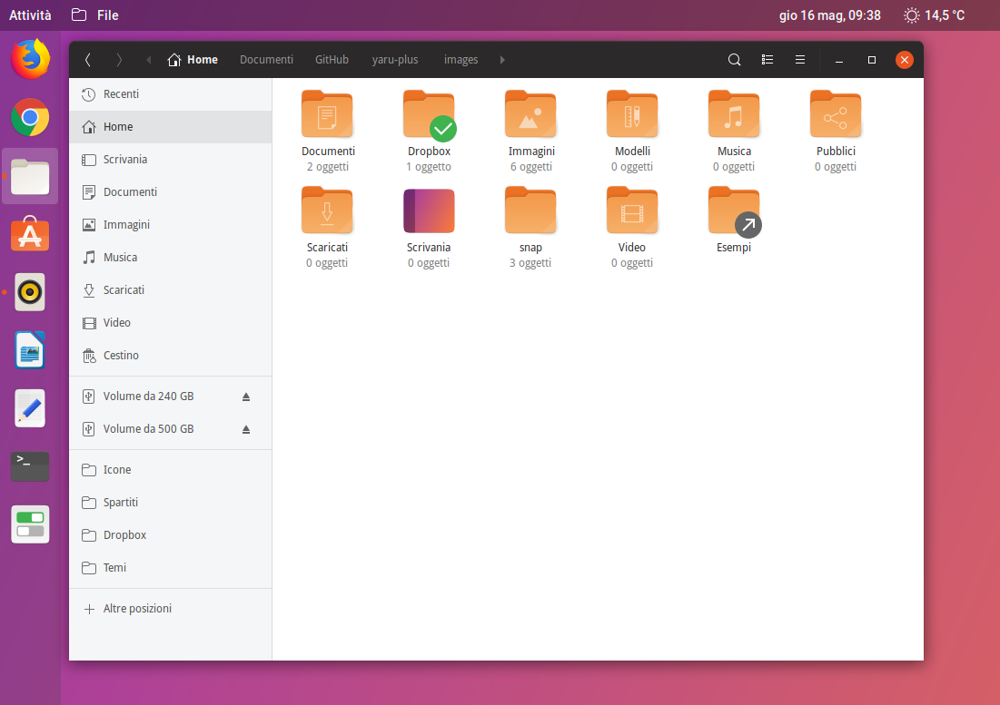
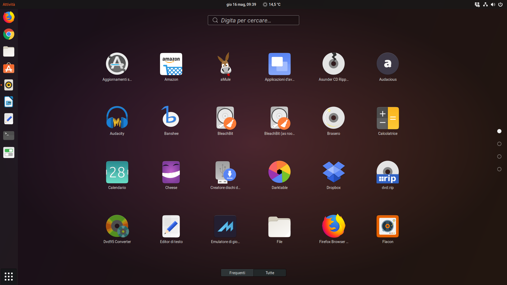

<p align="center">
    
</p>

<p align="center">
    
</p>

<h4 align="center">A third-party Yaru++ icons for more than 20 distributions </h4>
<h4 align="center">An elegant, flat and modern based on <a href="https://github.com/ubuntu/yaru">Yaru</a> icons by Ubuntu developers</h4>

- [Screenshot](#screenshot)
- [Installation](#installation)
  - [Installing the stable version with CLI](#installing-the-stable-version-with-cli)
    - [ROOT directory (recommended)](#root-directory-recommended)
    - [HOME directory for GTK](#home-directory-for-gtk)
    - [HOME directory for KDE](#home-directory-for-kde)
    - [\*BSD systems](#bsd-systems)
    - [Uninstall](#uninstall)
  - [Installing the beta/dev version with CLI](#installing-the-betadev-version-with-cli)
    - [ROOT directory (recommended)](#root-directory-recommended-1)
    - [HOME directory for GTK](#home-directory-for-gtk-1)
    - [HOME directory for KDE](#home-directory-for-kde-1)
    - [\*BSD systems](#bsd-systems-1)
    - [Uninstall](#uninstall-1)
- [Bugs](#bugs)
- [Request](#request)
- [Credits and Licences](#credits-and-licences)

# Screenshot




# Installation

## Installing the stable version with CLI

Use the scripts to install the latest version directly from this repository (independently of your distribution):

**NOTE:** Use the same command to update the icon theme.

### ROOT directory (recommended)

```
wget -qO- https://raw.githubusercontent.com/Bonandry/yaru-plus/master/install.sh | sh
```

### HOME directory for GTK

```
wget -qO- https://raw.githubusercontent.com/Bonandry/yaru-plus/master/install.sh | env DESTDIR="$HOME/.icons" sh
```

### HOME directory for KDE

```
wget -qO- https://raw.githubusercontent.com/Bonandry/yaru-plus/master/install.sh | env DESTDIR="$HOME/.local/share/icons" sh
```

### \*BSD systems

```
wget -qO- https://raw.githubusercontent.com/Bonandry/yaru-plus/master/install.sh | env DESTDIR="/usr/local/share/icons" sh
```

### Uninstall

```
wget -qO- https://raw.githubusercontent.com/Bonandry/yaru-plus/master/install.sh | env uninstall=true sh
```

## Installing the beta/dev version with CLI

You will receive daily or weekly the latest commits directly from this repository (independently of your distribution). It is important to observe that the beta version may show some unstability, bugs and broken something. 

**NOTE:** Use the same command to update the icon theme.

### ROOT directory (recommended)

```
wget -qO- https://raw.githubusercontent.com/Bonandry/yaru-plus/master/install.sh | TAG=beta sh
```

### HOME directory for GTK

```
wget -qO- https://raw.githubusercontent.com/Bonandry/yaru-plus/master/install.sh | TAG=beta env DESTDIR="$HOME/.icons" sh
```

### HOME directory for KDE

```
wget -qO- https://raw.githubusercontent.com/Bonandry/yaru-plus/master/install.sh | TAG=beta env DESTDIR="$HOME/.local/share/icons" sh
```

### \*BSD systems

```
wget -qO- https://raw.githubusercontent.com/Bonandry/yaru-plus/master/install.sh | TAG=beta env DESTDIR="/usr/local/share/icons" sh
```

### Uninstall

```
wget -qO- https://raw.githubusercontent.com/Bonandry/yaru-plus/master/install.sh | TAG=beta env uninstall=true sh
```
# Bugs

Please visit the [wiki about the bugs at Suru++ Ubuntu](https://github.com/Bonandry/suru-plus-ubuntu/wiki)

# Request

Please visit the [wiki about how to request an icon at Suru++ Ubuntu](https://github.com/Bonandry/suru-plus-ubuntu/wiki/Report)

# Credits and Licences

* CC BY-SA/GPL3 © 2018-2019 [Yaru Icons](https://github.com/ubuntu/yaru) by Ubuntu developers.
* CC BY-SA/GPL3 © 2018-2019 [Suru Icons](https://github.com/snwh/suru-icon-theme) by [Sam Hewitt](https://github.com/snwh).
* LGPL3/CC-BY-SA © <a href="https://github.com/GNOME/adwaita-icon-theme">Adwaita Icons</a> by 2019 GNOME Project
* GPL3 © [Papirus](https://github.com/PapirusDevelopmentTeam/) by [Alexey Varfolomeev](https://github.com/varlesh).
* GPL3 © 2019 Yaru++ by Andrea Bonanni and Gustavo Costa.