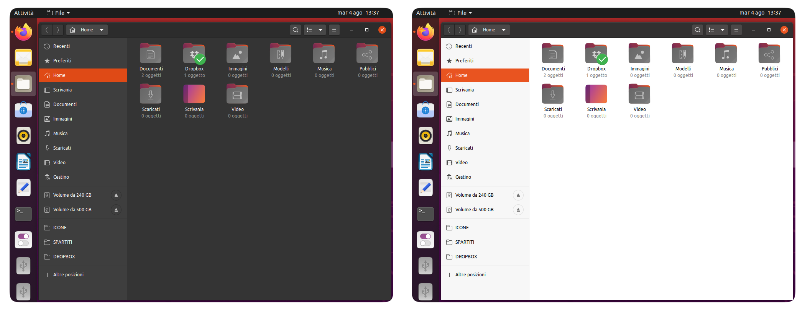
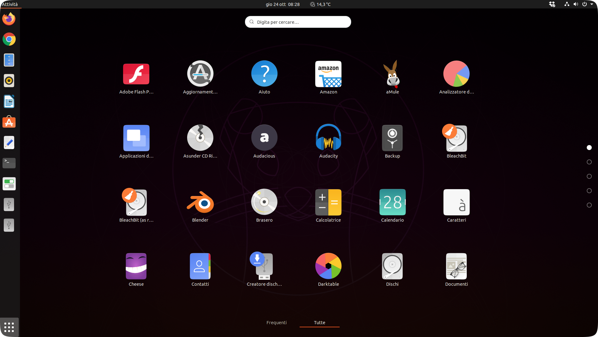

<p align="center">
    
</p>

<p align="center">
    
</p>

<h4 align="center">A third-party Yaru++ icons for more than 20 distributions </h4>
<h4 align="center">An elegant, flat and modern based on <a href="https://github.com/ubuntu/yaru">Yaru</a> icons by Canonical developers</h4>

- [Screenshot](#screenshot)
- [Difference between alternative icons themes](#difference-between-alternative-icons-themes)
- [Installation](#installation)
  - [Installing the stable version with CLI and with complete pack](#installing-the-stable-version-with-cli-and-with-complete-pack)
    - [ROOT directory (recommended)](#root-directory-recommended)
    - [HOME directory for GTK](#home-directory-for-gtk)
    - [HOME directory for KDE](#home-directory-for-kde)
    - [\*BSD systems](#bsd-systems)
  - [Installing the stable version with CLI and with specific pack](#installing-the-stable-version-with-cli-and-with-specific-pack)
    - [ROOT directory (recommended)](#root-directory-recommended-1)
      - [Only Yaru++](#only-yaru)
      - [Only Yaru++ and Yaru++ Dark](#only-yaru-and-yaru-dark)
      - [Only Yaru++ and Yaru++ Color](#only-yaru-and-yaru-color)
      - [Only kYaru++ and Yaru++](#only-kyaru-and-yaru)
      - [Only Yaru++ and Yaru++ Smooth](#only-yaru-and-yaru-smooth)
      - [Only Yaru++ Minimal](#only-yaru-minimal)
    - [HOME directory for GTK](#home-directory-for-gtk-1)
      - [Only Yaru++](#only-yaru-1)
      - [Only Yaru++ and Yaru++ Dark](#only-yaru-and-yaru-dark-1)
      - [Only Yaru++ and Yaru++ Color](#only-yaru-and-yaru-color-1)
      - [Only kYaru++ and Yaru++](#only-kyaru-and-yaru-1)
      - [Only Yaru++ and Yaru++ Smooth](#only-yaru-and-yaru-smooth-1)
      - [Only Yaru++ Minimal](#only-yaru-minimal-1)
    - [HOME directory for KDE](#home-directory-for-kde-1)
      - [Only Yaru++](#only-yaru-2)
      - [Only Yaru++ and Yaru++ Dark](#only-yaru-and-yaru-dark-2)
      - [Only Yaru++ and Yaru++ Color](#only-yaru-and-yaru-color-2)
      - [Only kYaru++ and Yaru++](#only-kyaru-and-yaru-2)
      - [Only Yaru++ and Yaru++ Smooth](#only-yaru-and-yaru-smooth-2)
      - [Only Yaru++ Minimal](#only-yaru-minimal-2)
    - [\*BSD systems](#bsd-systems-1)
      - [Only Yaru++](#only-yaru-3)
      - [Only Yaru++ and Yaru++ Dark](#only-yaru-and-yaru-dark-3)
      - [Only Yaru++ and Yaru++ Color](#only-yaru-and-yaru-color-3)
      - [Only kYaru++ and Yaru++](#only-kyaru-and-yaru-3)
      - [Only Yaru++ and Yaru++ Smooth](#only-yaru-and-yaru-smooth-3)
      - [Only Yaru++ Minimal](#only-yaru-minimal-3)
    - [Uninstall](#uninstall)
  - [Installing the beta/dev version with CLI](#installing-the-betadev-version-with-cli)
    - [ROOT directory (recommended)](#root-directory-recommended-2)
    - [HOME directory for GTK](#home-directory-for-gtk-2)
    - [HOME directory for KDE](#home-directory-for-kde-2)
    - [\*BSD systems](#bsd-systems-2)
    - [Uninstall](#uninstall-1)
  - [Installing the nightly version with CLI](#installing-the-nightly-version-with-cli)
    - [ROOT directory (recommended)](#root-directory-recommended-3)
    - [HOME directory for GTK](#home-directory-for-gtk-3)
    - [HOME directory for KDE](#home-directory-for-kde-3)
    - [\*BSD systems](#bsd-systems-3)
    - [Uninstall](#uninstall-2)
- [Bugs](#bugs)
- [Request](#request)
- [Credits and Licences](#credits-and-licences)

# Screenshot





# Difference between alternative icons themes

* <b>Yaru++:</b> The normal icons theme, based on <a href="https://github.com/ubuntu/yaru">Yaru</a> icons by Canonical developers. It does not have dependencies on other icons themes.
* <b>Yaru++ Color</b> Based on original Yaru, 16px icons are colourful and symlink to 24px and 32px. 16px and 48px icons are sharpened. It requires dependency on Yaru++.
* <b>Yaru++ Dark:</b> The dark version of Yaru++ for dark GUI or window manager. It requires dependency on Yaru++.
* <b>Yaru++ Minimal:</b> The minimal icons theme containing only third-party icons and excluding the files that already exist in the Canonical's <a href="https://github.com/ubuntu/yaru">Yaru</a> original icons theme. It requires dependency on original Yaru. <b>DO NOT use Snap, prefer PPA.</b>
* <b>Yaru++ Smooth:</b> The 32px and 48px icons are symlinked to colourful scalable icons instead of sharpened icons that are hated by the perfectionists. It requires dependency on Yaru++.
* <b>kYaru++:</b> Compatible with Kvantum and Qt5ct. It requires dependency on Yaru++.

# Installation

## Installing the stable version with CLI and with complete pack

Use the scripts to install the latest version directly from this repository (independently of your distribution):

**NOTE:** Use the same command to update the icon theme.

### ROOT directory (recommended)

```
wget -qO- https://raw.githubusercontent.com/Bonandry/yaru-plus/master/install.sh | sh
```

### HOME directory for GTK

```
wget -qO- https://raw.githubusercontent.com/Bonandry/yaru-plus/master/install.sh | env DESTDIR="$HOME/.icons" sh
```

### HOME directory for KDE

```
wget -qO- https://raw.githubusercontent.com/Bonandry/yaru-plus/master/install.sh | env DESTDIR="$HOME/.local/share/icons" sh
```

### \*BSD systems

```
wget -qO- https://raw.githubusercontent.com/Bonandry/yaru-plus/master/install.sh | env DESTDIR="/usr/local/share/icons" sh
```

## Installing the stable version with CLI and with specific pack

If you do not want to install icons themes, you can specificy icons themes, excluding others

**NOTE:** Use the same command to update the icon theme.

### ROOT directory (recommended)

#### Only Yaru++

```zsh
wget -qO- https://raw.githubusercontent.com/Bonandry/yaru-plus/master/install.sh | THEMES=Yaru++ sh
```

#### Only Yaru++ and Yaru++ Dark

```zsh
wget -qO- https://raw.githubusercontent.com/Bonandry/yaru-plus/master/install.sh | THEMES='Yaru++ Yaru++-Dark' sh
```

#### Only Yaru++ and Yaru++ Color

```zsh
wget -qO- https://raw.githubusercontent.com/Bonandry/yaru-plus/master/install.sh | THEMES='Yaru++ Yaru++-Color' sh
```

#### Only kYaru++ and Yaru++

```zsh
wget -qO- https://raw.githubusercontent.com/Bonandry/yaru-plus/master/install.sh | THEMES='kYaru++ Yaru++' sh
```

#### Only Yaru++ and Yaru++ Smooth

```zsh
wget -qO- https://raw.githubusercontent.com/Bonandry/yaru-plus/master/install.sh | THEMES='Yaru++ Yaru++-Smooth' sh
```

#### Only Yaru++ Minimal

For Ubuntu users:
  - <b>Old versions:</b> You must install manually original Yaru icons's latest version onto `/usr/share/icons/`;
  - <b>18.04, 19.04 and 19.10:</b> Yaru icons are already installed, but outdated. You must upgrade the icons theme. Prefer the PPA. <b>DO NOT</b> use Snap!
  - <b>20.04 and above:</b> No installed. It is already Yaru icons' latest version, and it is well located in `/usr/share/icons/`.

```zsh
wget -qO- https://raw.githubusercontent.com/Bonandry/yaru-plus/master/install.sh | THEMES='Yaru++-Minimal' sh
```

### HOME directory for GTK

#### Only Yaru++

```zsh
wget -qO- https://raw.githubusercontent.com/Bonandry/yaru-plus/master/install.sh | THEMES=Yaru++ env DESTDIR="$HOME/.icons" sh
```

#### Only Yaru++ and Yaru++ Dark

```zsh
wget -qO- https://raw.githubusercontent.com/Bonandry/yaru-plus/master/install.sh | THEMES='Yaru++ Yaru++-Dark' env DESTDIR="$HOME/.icons" sh
```

#### Only Yaru++ and Yaru++ Color

```zsh
wget -qO- https://raw.githubusercontent.com/Bonandry/yaru-plus/master/install.sh | THEMES='Yaru++ Yaru++-Color' env DESTDIR="$HOME/.icons" sh
```

#### Only kYaru++ and Yaru++

```zsh
wget -qO- https://raw.githubusercontent.com/Bonandry/yaru-plus/master/install.sh | THEMES='kYaru++ Yaru++' env DESTDIR="$HOME/.icons" sh
```

#### Only Yaru++ and Yaru++ Smooth

```zsh
wget -qO- https://raw.githubusercontent.com/Bonandry/yaru-plus/master/install.sh | THEMES='Yaru++ Yaru++-Smooth' env DESTDIR="$HOME/.icons" sh
```

#### Only Yaru++ Minimal

For Ubuntu users:
  - <b>Old versions:</b> You must install manually original Yaru icons's latest version onto `/usr/share/icons/`;
  - <b>18.04, 19.04 and 19.10:</b> Yaru icons are already installed, but outdated. You must upgrade the icons theme. Prefer the PPA. <b>DO NOT</b> use Snap!
  - <b>20.04 and above:</b> No installed. It is already Yaru icons' latest version, and it is well located in `/usr/share/icons/`.

```zsh
wget -qO- https://raw.githubusercontent.com/Bonandry/yaru-plus/master/install.sh | THEMES='Yaru++-Minimal' env DESTDIR="$HOME/.icons" sh
```

### HOME directory for KDE

#### Only Yaru++

```zsh
wget -qO- https://raw.githubusercontent.com/Bonandry/yaru-plus/master/install.sh | THEMES=Yaru++ env DESTDIR="$HOME/.local/share/icons" sh
```

#### Only Yaru++ and Yaru++ Dark

```zsh
wget -qO- https://raw.githubusercontent.com/Bonandry/yaru-plus/master/install.sh | THEMES='Yaru++ Yaru++-Dark' env DESTDIR="$HOME/.local/share/icons" sh
```

#### Only Yaru++ and Yaru++ Color

```zsh
wget -qO- https://raw.githubusercontent.com/Bonandry/yaru-plus/master/install.sh | THEMES='Yaru++ Yaru++-Color' env DESTDIR="$HOME/.local/share/icons" sh
```

#### Only kYaru++ and Yaru++

```zsh
wget -qO- https://raw.githubusercontent.com/Bonandry/yaru-plus/master/install.sh | THEMES='kYaru++ Yaru++' env DESTDIR="$HOME/.local/share/icons" sh
```

#### Only Yaru++ and Yaru++ Smooth

```zsh
wget -qO- https://raw.githubusercontent.com/Bonandry/yaru-plus/master/install.sh | THEMES='Yaru++ Yaru++-Smooth' env DESTDIR="$HOME/.local/share/icons" sh
```

#### Only Yaru++ Minimal

For Ubuntu users:
  - <b>Old versions:</b> You must install manually original Yaru icons's latest version onto `/usr/share/icons/`;
  - <b>18.04, 19.04 and 19.10:</b> Yaru icons are already installed, but outdated. You must upgrade the icons theme. Prefer the PPA. <b>DO NOT</b> use Snap!
  - <b>20.04 and above:</b> No installed. It is already Yaru icons' latest version, and it is well located in `/usr/share/icons/`.

```zsh
wget -qO- https://raw.githubusercontent.com/Bonandry/yaru-plus/master/install.sh | THEMES='Yaru++-Minimal' env DESTDIR="$HOME/.local/share/icons" sh
```

### \*BSD systems

#### Only Yaru++

```zsh
wget -qO- https://raw.githubusercontent.com/Bonandry/yaru-plus/master/install.sh | THEMES=Yaru++ env DESTDIR="/usr/local/share/icons" sh
```

#### Only Yaru++ and Yaru++ Dark

```zsh
wget -qO- https://raw.githubusercontent.com/Bonandry/yaru-plus/master/install.sh | THEMES='Yaru++ Yaru++-Dark' env DESTDIR="/usr/local/share/icons" sh
```

#### Only Yaru++ and Yaru++ Color

```zsh
wget -qO- https://raw.githubusercontent.com/Bonandry/yaru-plus/master/install.sh | THEMES='Yaru++ Yaru++-Color' env DESTDIR="/usr/local/share/icons" sh
```

#### Only kYaru++ and Yaru++

```zsh
wget -qO- https://raw.githubusercontent.com/Bonandry/yaru-plus/master/install.sh | THEMES='kYaru++ Yaru++' env DESTDIR="/usr/local/share/icons" sh
```

#### Only Yaru++ and Yaru++ Smooth

```zsh
wget -qO- https://raw.githubusercontent.com/Bonandry/yaru-plus/master/install.sh | THEMES='Yaru++ Yaru++-Smooth' env DESTDIR="/usr/local/share/icons" sh
```

#### Only Yaru++ Minimal

Observe that Canonical's original Yaru icons needs to be installed firstly

```zsh
wget -qO- https://raw.githubusercontent.com/Bonandry/yaru-plus/master/install.sh | THEMES='Yaru++-Minimal' env DESTDIR="/usr/local/share/icons" sh
```

### Uninstall

```zsh
wget -qO- https://raw.githubusercontent.com/Bonandry/yaru-plus/master/install.sh | env uninstall=true sh
```

## Installing the beta/dev version with CLI

You will receive daily or weekly the latest commits directly from this repository's branch `beta`, under @Bonandry's inspection. It is important to observe that the beta version may show some unstability, bugs and broken something as @Bonandry does not have knoweldge of the programming. 

**NOTE:** Use the same command to update the icon theme.

### ROOT directory (recommended)

```
wget -qO- https://raw.githubusercontent.com/Bonandry/yaru-plus/master/install.sh | TAG=beta sh
```

### HOME directory for GTK

```
wget -qO- https://raw.githubusercontent.com/Bonandry/yaru-plus/master/install.sh | TAG=beta env DESTDIR="$HOME/.icons" sh
```

### HOME directory for KDE

```
wget -qO- https://raw.githubusercontent.com/Bonandry/yaru-plus/master/install.sh | TAG=beta env DESTDIR="$HOME/.local/share/icons" sh
```

### \*BSD systems

```
wget -qO- https://raw.githubusercontent.com/Bonandry/yaru-plus/master/install.sh | TAG=beta env DESTDIR="/usr/local/share/icons" sh
```

### Uninstall

```
wget -qO- https://raw.githubusercontent.com/Bonandry/yaru-plus/master/install.sh | TAG=beta env uninstall=true sh
```

## Installing the nightly version with CLI

You will receive hourly or daily the latest commits directly from this repository's branch `nightly`, under @gusbemacbe's inspection. It is important to observe that the nightly version may show very few bugs, but without something broken as @gusbemacbe has knoweldge of programming. 

**NOTE:** Use the same command to update the icon theme.

### ROOT directory (recommended)

```
wget -qO- https://raw.githubusercontent.com/Bonandry/yaru-plus/master/install.sh | TAG=nightly sh
```

### HOME directory for GTK

```
wget -qO- https://raw.githubusercontent.com/Bonandry/yaru-plus/master/install.sh | TAG=nightly env DESTDIR="$HOME/.icons" sh
```

### HOME directory for KDE

```
wget -qO- https://raw.githubusercontent.com/Bonandry/yaru-plus/master/install.sh | TAG=nightly env DESTDIR="$HOME/.local/share/icons" sh
```

### \*BSD systems

```
wget -qO- https://raw.githubusercontent.com/Bonandry/yaru-plus/master/install.sh | TAG=nightly env DESTDIR="/usr/local/share/icons" sh
```

### Uninstall

```
wget -qO- https://raw.githubusercontent.com/Bonandry/yaru-plus/master/install.sh | TAG=nightly env uninstall=true sh
```

# Bugs

Please visit the [wiki about the bugs at Suru++ Ubuntu](https://github.com/Bonandry/suru-plus-ubuntu/wiki)

# Request

Please visit the [wiki about how to request an icon at Suru++ Ubuntu](https://github.com/Bonandry/suru-plus-ubuntu/wiki/Report)

# Credits and Licences

* CC BY-SA/GPL3 © 2018-2020 [Yaru Icons](https://github.com/ubuntu/yaru) by Ubuntu developers.
* CC BY-SA/GPL3 © 2018-2020 [Suru Icons](https://github.com/snwh/suru-icon-theme) by [Sam Hewitt](https://github.com/snwh).
* LGPL3/CC-BY-SA © <a href="https://github.com/GNOME/adwaita-icon-theme">Adwaita Icons</a> by 2019-2020 GNOME Project
* GPL3 © [Papirus](https://github.com/PapirusDevelopmentTeam/) by [Alexey Varfolomeev](https://github.com/varlesh).
* GPL3 © 2019-2020 Yaru++ by Andrea Bonanni and Gustavo Costa.