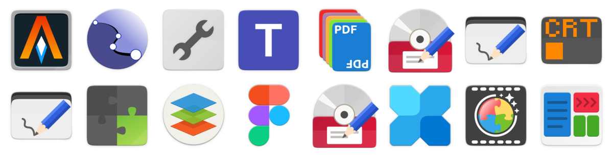
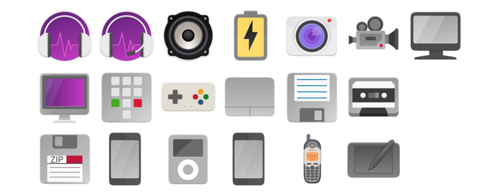
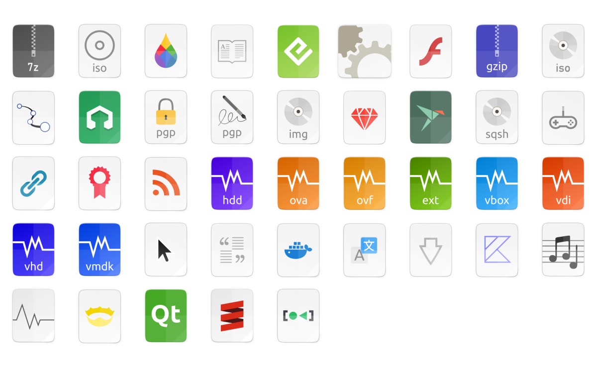
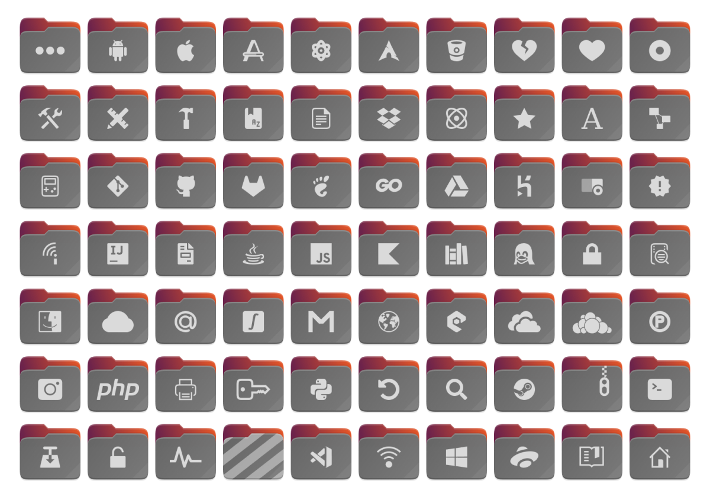
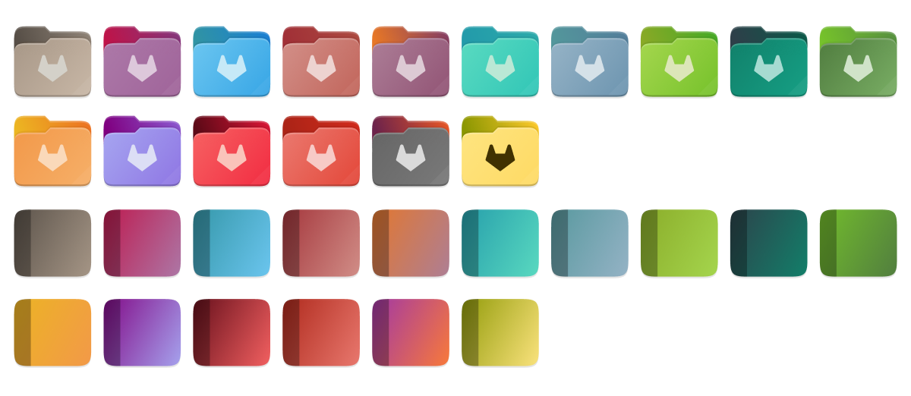
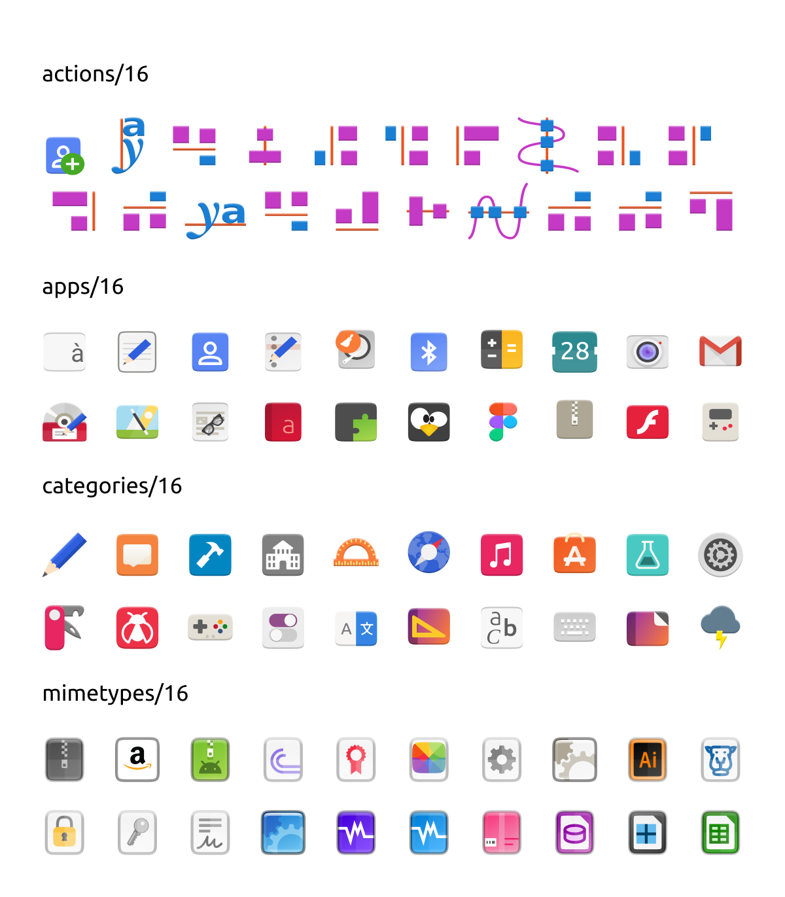

# 4.0 — Abacaxi al Cioccolato

## Motivo da ausência

Peço muita desculpa pela longa ausência, principalmente a do @gusbemacbe. Sou apenas um *designer* gráfico, tenho medo de mexer com os comandos `git` porque eu costumava quebrar meus projetos; portanto, melhor eu deixar meus projetos nas mãos do @gusbemacbe. Vou explicar o motivo da ausência dele.

Devido à pandemia do COVID-19, a situação de vida dele mudou repentinamente e ele não conseguiu acessar o equipamento de computador necessário e as informações da conta para trabalhar no projeto. Ele pede desculpas pelo atraso e está feliz por estar de volta ao topo!

## O que há de novo?

Desde 9 de fevereiro, com a contribuição da *branch* `beta` de @Bonandry e da *branch* `gusbemacbe` do @gusbemacbe, foram 221 *commits* a seguir:

### Adições

#### Aplicativos

- 36 ícones de aplicativos foram adicionados:
  - Alacritty (#52)
  - Calligra Karbon
  - Celluloid (#51)
  - Cool Retro Term (#50)
  - Drawing (do @maoschanz e #51)
  - Figma
  - GabTag
  - GNOME Extensões (#51)
  - Microsoft Exchange
  - Microsoft Teams (#51)
  - OnlyOffice (#51)
  - Photoflare
  - Pyzo (#46)
  - Visual Studio Code (#51)

#### Aparelhos

- 5 ícones 16px de aparelhos foram adicionados.

- 54 ícones escaláveis de aparelhos ​​foram adicionados.

#### Tipos de arquivos de mídia

- 153 ícones 16px de tipos de arquivos de mídia foram adicionados.

- 166 ícones escaláveis de tipos de arquivos de mídia foram adicionados.

#### Pastas

- 138 ícones 16px de pastas foram adicionados.
- 1646 ícones escaláveis de pastas foram adicionados.

#### Estado/*status*

- 6 ícones 16px de estado/*status* foram adicionados.
- 13 ícones escaláveis de estado/*status* foram adicionados.

### Modificações

#### Aplicativos

- 158 aplicativos foram modificados e atualizados para melhorias:
  - Asunder
  - Audacious
  - Audacity
  - Cheese
  - Configurator App
  - DarkTable
  - DConf Editor
  - Dropbox
  - Emule
  - Etichetta (Etiqueta)
  - Evolution
  - Firefox
  - Foursquare
  - Gimp
  - gThumb (#47)
  - iBus
  - Imagination
  - Ingranaggio (Engrenagem)
  - LibreOffice
  - Microsoft
  - MPV (#45)
  - PDF Arranger (#47)
  - PCSX2
  - Puddletag
  - Registratore (Assistente virtual)
  - Scanner
  - Snap Store
  - SoundRecorder
  - Strumenti (Configurações)
  - Todoist
  - Torrent
  - Totem
  - Ubuntu One
  - USB
  - Vim
  - Windows
  - Xterm

#### Aparelhos

- 9 ícones 16px de aparelhos foram modificados.
- 8 ícones escaláveis de aparelhos foram modificados.

#### Tipos de arquivos de mídia

- 44 ícones 16px de tipos de arquivos de mídia foram modificados.
- 60 ícones escaláveis de tipos de arquivos de mídia foram modificados.

#### Pastas

- 1 ícones 16px de pastas foram modificados.
- 2 ícones escaláveis de pastas foram modificados.

#### Estado/*status*

- 15 ícones 16px de estado/*status* foram adicionados.
- 4 ícones escaláveis de estado/*status* foram adicionados.

### Melhorias

- Inúmeros links simbólicos quebrados foram corrigidos;
- O erro de ortografia de `emmoltes/emotes` no arquivo `index.theme` foi corrigido (#39);
- Corrigidas funções SVG nos ícones não suportadas pelo KDE;
- Corrigida herança do Yaru++ (#44);
- Pastas do Yaru++ foram reorganizadas;
- Todos os ícones do Yaru++ foram reorganizados e reconectados/religados/revinculados corretamente.

### Novas funções

- Adicionadas 67 novas categorias de pastas (#25), incluindo 32px e 48px:
  - Android
  - Aplicativos
  - Apple
  - Atividades
  - Atom
  - AUR
  - Biblioteca
  - Bitbucket
  - Bloqueado
  - CD/Imagens RAW/ISO
  - Configuração/Ferramentas
  - Correio eletrônico
  - Desbloqueado
  - Desenvolvimento
  - *Design*
  - Dicionários
  - Dropbox
  - Electron
  - Executável
  - Fatura
  - Favoritos
  - Fontes
  - Fotos
  - FreeDesktop
  - Git
  - GitHub
  - GitLab
  - GNOME
  - Go
  - Google Drive
  - Heroku
  - Ícones
  - Importante
  - Impressoras
  - Insync
  - Intellij
  - Java
  - Javascript
  - Jogos
  - Kotlin
  - Linux
  - Log
  - macOS
  - Mail Cloud
  - Marcadores
  - Marcadores perdidos
  - Matemática
  - Mega
  - NodeJS
  - OneDrive
  - OwnCloud
  - PCloud
  - Pesquisa
  - PHP
  - Privado
  - Python
  - Recente
  - Rede
  - Rede sem fio
  - Steam
  - TAR
  - Torrent
  - VirtualBox
  - Visitante
  - VSCode
  - Wine
  - Yandex Disk
- Adicionadas 15 novas cores de pastas (#25), incluindo 32px e 48px:

  

#### kYaru++

É um novo tema de ícones projetado para ser compatível com o Kvantum e o Qt5ct, em referência ao item #32.

#### Yaru++ Colorido

Baseado nos ícones coloridos de 16px, 24px, 32px e 48px do Yaru original, é derivado do Yaru++, mas com ícones coloridos de 16px, 24px, 32px e 48px.

#### Yaru++ Mínimo

Em referência ao item #48, derivado do Yaru++ Colorido e Yaru++, é um tema de ícones mínimo com apenas ícones terceirizados e excluindo os ícones que já existem no tema original de ícones do Yaru. Herda do tema original de ícones Yaru. Não inclui as cores das pastas. Tem apenas 11,5MB de tamanho, enquanto o Yaru++ completo tem 71,2MB de tamanho.

#### Yaru++ Suave

Derivados do Yaru++, mas os ícones de 24px são vinculados a pasta 16px, e os de 32px e 48px são vinculados aos ícones escalonáveis, portanto, são livres de nitidez, em referência ao item #35.