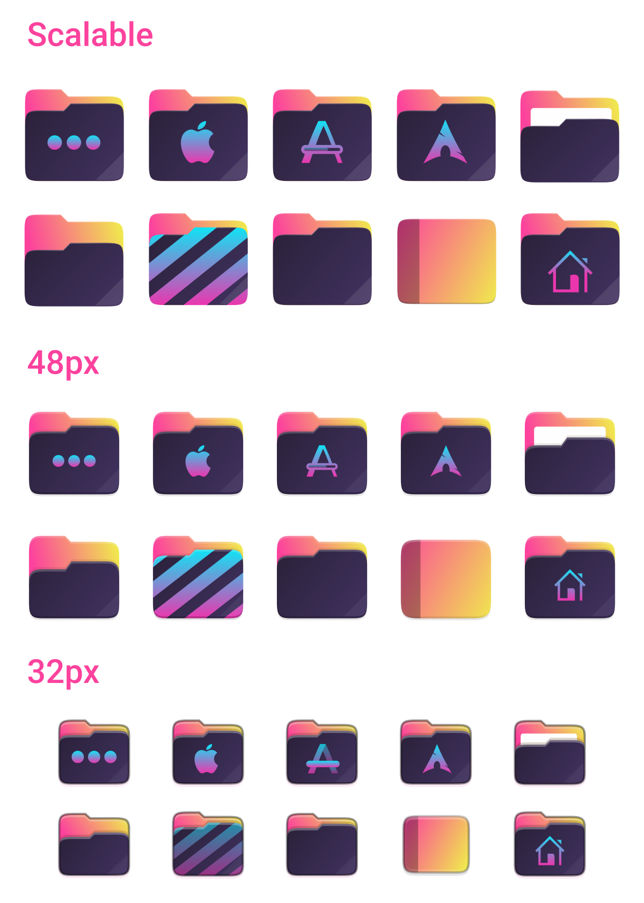
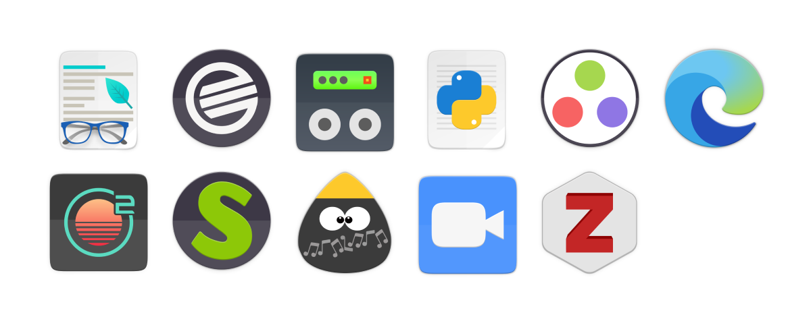

# 4.1 – Archidi Von Hunty

## What's New?

Since August 31, there has been just a small update with few commits, but the mimetypes icons were upgraded and some new icons have been added. The new folders style inpsired by VSCode's [Synthwave ‘84 theme](https://marketplace.visualstudio.com/items?itemName=RobbOwen.synthwave-vscode).

### Additions

#### Apps

- 9 apps icons have been added
  - Foliate (#63)
  - Guitar Rig
  - Julia (#64)
  - Microsoft Edge (#65)
  - Onivim 2 (#65)
  - Python Idle 3 (#63)
  - Scummvm (#64)
  - Tuxguitar (#63)
  - Zoom (#64)
  - Zotero (#64)

#### Devices

- Only one 48px “multimedia-player” icon has been added. 

#### Emblems

- 4 emblems 16px icons have been added.

#### Mimetypes

The partial mimetypes folder has been upgraded.

- 2 Yaru++ mimetypes 16px icons have been added.
- 7 Yaru++ Colour mimetypes 16px icons have been added.
- 10 mimetypes 48px icons have been added.
- 10 mimetypes scalable icons have been added.

#### Places

- Added new folder style – Synthwave ‘84.

#### Status

- 1 status 24px icon has been added.

### Modifications

#### Apps

- 7 apps 16px icons have been modified and updated – emoji icons. 
- 8 apps symbolic icons have been modified and updated – emoji icons. 

#### Mimetypes

- 1 Yaru++ mimetype 16px icon – `text-x-meson` – has been modified.
- 74 Yaru++ Colour mimetype 16px icons have been upgraded.
- 143 mimetypes 48px icons have been upgraded. 
- 91 mimetypes scalable icons have been upgraded. 
